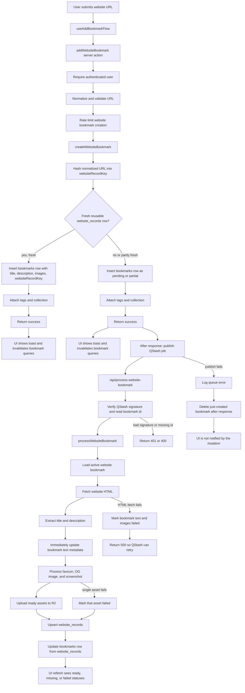

# Website Bookmark Creation Flow

This is the path for creating a `website` bookmark: from the add-bookmark UI, through the database, QStash, enrichment, `website_records`, and error handling.

## Main Creation Path

1. The UI calls `addWebsiteBookmark` from `useAddBookmarkFlow` and closes the dialog.
2. The server action checks login, normalizes the URL, rejects invalid/non-website URLs, then applies rate limiting.
3. `createWebsiteBookmark` hashes the normalized URL into a stable `websiteRecordKey`.
4. It checks `website_records` for a reusable record.
5. It inserts a row in `bookmarks`.
6. It attaches tags and collection if provided.
7. If the existing `website_records` data is fully fresh, the bookmark is done immediately.
8. If data is missing, stale, or only partly fresh, the server action still returns success, then schedules QStash enrichment with `after(...)`.

## website_records

`website_records` is the shared cache for a normalized URL. It stores:

- `key`: hash of the normalized URL.
- `normalized_url` and `hostname`.
- `title` and `description`.
- `images`: favicon, OG image, and preview screenshot info.
- `html_status` and `preview_status`: `ready`, `missing`, or `failed`.
- refresh timestamps that decide whether the record can be reused.
- `html_fetched_at`, `preview_fetched_at`, and per-asset `images.*.fetchedAt` track when each asset was last uploaded.

When a fully fresh record exists, new bookmarks can reuse its title, description, and images without waiting for QStash. When only the HTML or preview side is fresh, the bookmark reuses the available cached record data and still queues enrichment.

## Stale HTML Refresh

When `html_refresh_after` is in the past, enrichment treats favicon and OG as stale:

1. the QStash job loads the existing `website_records` row,
2. ignores the R2 "already exists" shortcut for favicon and OG,
3. re-fetches and overwrites the same R2 keys,
4. sets `images.favicon.fetchedAt` and `images.og.fetchedAt` only when a new upload happened,
5. updates `html_fetched_at` only when favicon or OG was actually re-uploaded,
6. extends `html_refresh_after` by another 90 days when the HTML-side assets stay `ready`.

If HTML is still fresh and the R2 objects exist, enrichment skips re-upload and keeps the previous `html_fetched_at` and asset `fetchedAt` values.

## Stale Preview Refresh

When `preview_refresh_after` is in the past, enrichment treats the preview as stale:

1. the QStash job loads the existing `website_records` row,
2. ignores the R2 "already exists" shortcut for preview,
3. takes a new screenshot and overwrites the same R2 key,
4. sets `images.preview.fetchedAt` and `preview_fetched_at` only when a new upload happened,
5. extends `preview_refresh_after` by another 90 days when preview stays `ready`.

If preview is still fresh and the R2 object exists, enrichment skips re-upload and keeps the previous `preview_fetched_at`.

## Pending Bookmark State

When no fully fresh record exists, the bookmark is still created right away.

- `metadata.textMetadataStatus` is set to `pending` unless fresh HTML metadata was reused.
- image statuses are `pending` with deterministic R2 keys when no reusable record data exists.
- if only part of a `website_records` row is fresh, the bookmark can start with cached title/description or images while the stale side is refreshed.
- when preview is stale but other record data is reused, `images.preview.status` starts as `pending` so the UI polls until the refreshed screenshot is saved.
- when HTML is stale but other record data is reused, `images.favicon.status` and `images.og.status` start as `pending` so the UI polls until refreshed assets are saved.
- the UI refetches pending bookmarks until processing finishes.

## QStash Enrichment

After the server response, QStash is published with `{ id: bookmarkId }` and two retries configured:

`/api/process-website-bookmark`

That route:

1. verifies the Upstash signature,
2. reads the bookmark id,
3. fetches the current bookmark,
4. fetches the website HTML,
5. extracts title/description,
6. immediately updates the original `bookmarks` row with title, description, and `metadata.textMetadataStatus`,
7. processes favicon, OG image, and screenshot (re-uploading HTML-side assets when stale, preview when stale),
8. uploads ready assets to R2,
9. upserts `website_records`,
10. updates the original `bookmarks` row from the record.

## Updates After Processing

After text metadata extraction succeeds, `bookmarks` is updated immediately with:

- title and description, but only if the bookmark does not already have them
- `metadata.textMetadataStatus` set to `ready` or `missing`
- `updated_at`

After asset processing and the `website_records` upsert complete, `bookmarks` is updated again from `website_records` with:

- `website_record_key`
- title and description, but only if the bookmark does not already have them
- images from `website_records`, while preserving the user's selected image type when possible
- `metadata.textMetadataStatus` from the record's HTML status
- `updated_at`

## Error Paths

- Invalid URL: server action throws before creating a bookmark.
- Rate limit or auth failure: server action stops before creating a bookmark.
- QStash publish failure: the error is logged and the just-created bookmark is deleted after the server response; the mutation has already returned success, so no error is thrown to the UI.
- Bad QStash signature: process route returns `401`.
- Missing QStash id: process route returns `400`.
- HTML fetch failure: bookmark text/images are marked `failed`, then the route returns `500` so QStash can retry.
- Single asset failure: that asset becomes `failed`, the rest can still be saved and the bookmark still updates.
- Bookmark deleted during processing: processor stops and does not update it.

## Main Files

- `app/src/features/add-item/_hooks/use-add-bookmark-flow.ts`
- `app/src/app/actions/bookmarks/create.ts`
- `app/src/lib/bookmarks/website/create.ts`
- `app/src/lib/bookmarks/website/queue.ts`
- `app/src/app/api/(process)/process-website-bookmark/route.ts`
- `app/src/lib/bookmarks/website/job-request.ts`
- `app/src/lib/bookmarks/website/process.ts`
- `app/src/lib/bookmarks/website/records.ts`
- `app/src/lib/bookmarks/website/refresh.ts`
- `app/src/lib/bookmarks/website/assets.ts`
- `app/src/lib/bookmarks/website/status-updates.ts`
- `app/src/db/schema.ts`
